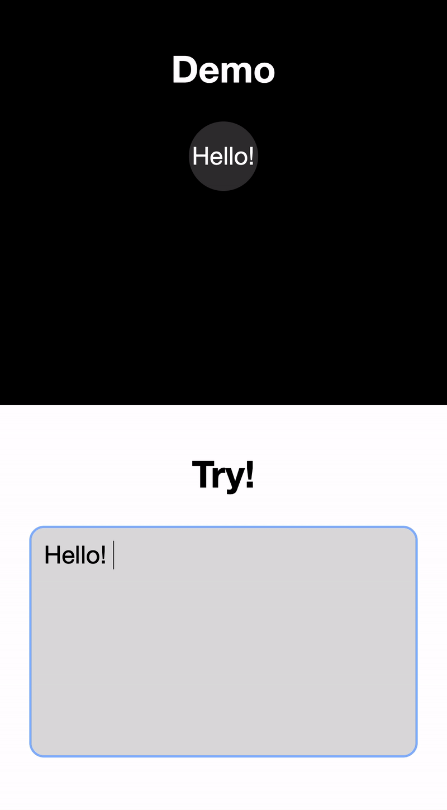

# AdaptiveCircleText
This repo is for adaptive circle which wrap text in a 'just-fit' way.
Basically, you can have your text just wrapped in a circle easily, and the text will fit in the circle just fine!

# Demo
 Try it here https://bofei.io/AdaptiveCircleText/

